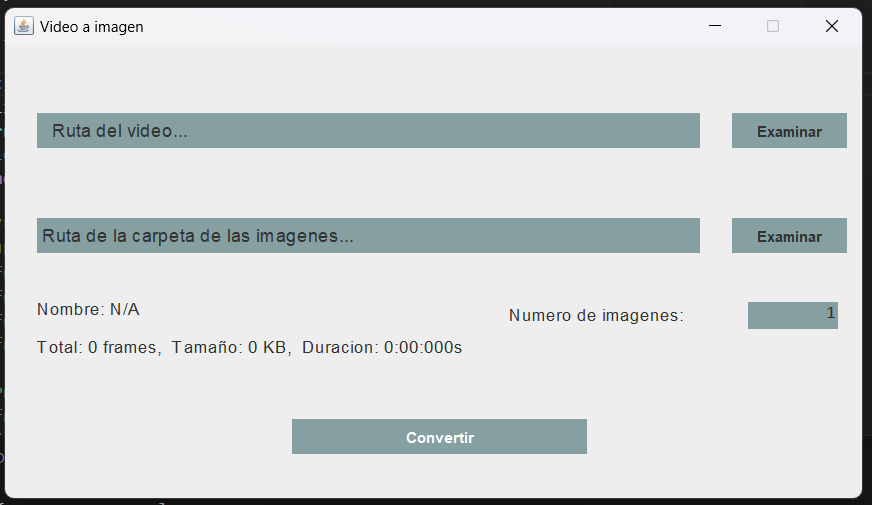

# Video to Image Converter

This is a **Java application** that converts a video into a series of images. The user can define the number of images to extract from the video, and the application uses **JavaCV** for video processing. The project is managed using **Maven** as the dependency management tool.



---

## Features 📋

- **Video to Image Conversion**: Extract frames from a video and save them as individual images.
- **User-Defined Frame Count**: The user specifies how many images they want to extract from the video.
- **JavaCV Integration**: Leverages JavaCV for handling the video frame extraction process.
- **Maven Managed**: Project dependencies and build configurations are managed using Maven.

---

## Technologies Used ⚙️

- **Java**: The application is written in Java.
- **JavaCV**: The JavaCV library is used to read video frames and process them.
- **FFmpeg**: JavaCV uses FFmpeg under the hood to manage video decoding.
- **Maven**: Handles the project dependencies and build lifecycle.

---

## Installation and Execution 🔧

1. Clone the repository or download the ZIP file:
    ```bash
    git clone https://github.com/yourusername/video-to-image-converter.git
    ```
2. Navigate to the project directory:
    ```bash
    cd video-to-image-converter
    ```
3. Install the Maven dependencies:
    ```bash
    mvn install
    ```
4. Compile and package the project:
    ```bash
    mvn package
    ```
5. Run the application:
    ```bash
    java -cp target/video-to-image-converter-1.0.jar com.mediaconverter.Main
    ```

---

## Project Structure 🔩

```
video-to-image-converter/
├── src/
│     └── main/
│           └── java/
│                 └── com/
│                       └── mediaconverter/
│                             ├── Main.java           # Main class to launch the app
│                             ├── VideoToImage.java   # Logic for video frame extraction
│           └── resources/
│                 └── example-video.mp4               # Sample video for testing
├── pom.xml                                           # Maven configuration file
└── README.md                                         # README file with project details
```

---

## Usage 🛠️

### 1. Video to Image Extraction

- Select the video file and define the number of images to extract.
- The application will process the video and extract the specified number of frames, saving them as `.png` or `.jpg` files.

---

## Learning Objectives 🎓

- **Video Frame Extraction**: Learn how to extract frames from a video and save them as images.
- **JavaCV and FFmpeg**: Understand how to leverage JavaCV and FFmpeg for multimedia processing.
- **Maven Dependency Management**: Manage project dependencies and build with Maven.

---

## Known Issues 🐞

- **Video Format Limitations**: The application supports common formats, but some specific video formats may cause issues.
- **Performance**: Large videos with a high number of frame extractions might lead to performance bottlenecks.

---

## Future Improvements 🚀

- **Support for More Image Formats**: Add support for more image formats (e.g., `.bmp`, `.tiff`).
- **Dynamic Frame Rate Selection**: Allow users to select frames based on specific intervals (e.g., every N seconds).
- **Progress Indicator**: Show the progress of the image extraction process.

---

## Special Thanks 🎁

Thanks to the JavaCV and FFmpeg communities for providing resources to make this project possible.

---

Made by [Mansour] - mansourlol440@gmail.com